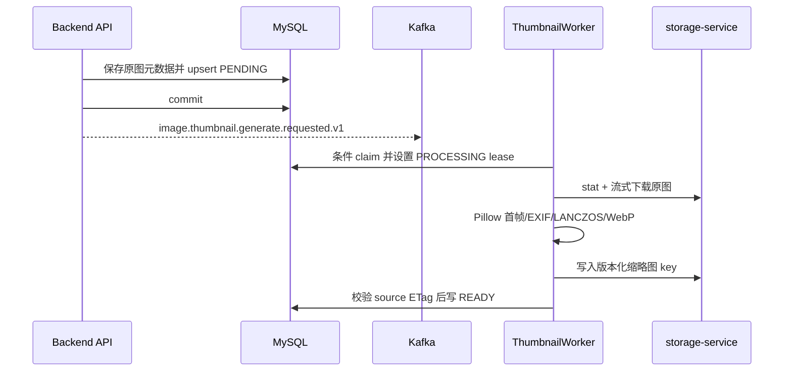

# 异步影像缩略图流水线

## 职责边界

- Imaging domain 定义派生 variant、状态、格式支持和版本化 object key。
- Application 在影像内容事务内登记 PENDING，提交后发布 Kafka；发布失败不回滚原图。
- Infrastructure 负责 SQLAlchemy 状态持久化、storage-service 流式读写和 Pillow 转换。
- Interface 提供 HTTP variant API、ThumbnailWorker 进程和手动 backfill CLI。
- Object lifecycle 在软删除保留期结束后同时清理原图和当前派生对象。

上传、批量导入和内容替换共享 `ThumbnailSchedulingService`。重命名及检查类型修改不涉及
原图字节和 ETag，因此不触发缩略图。

## 处理流程

消息 key 为 `image_file_id`。数据库 claim 和原图 ETag 写回条件保证 Kafka 至少一次投递、
重复消息和内容替换竞态下的幂等性。旧 READY 对象的引用在新版本完成前一直保留；Worker
先幂等删除旧对象再切换 READY 引用，失败时可按同一确定性新 key 重试，不丢失清理指针。

### 并发写入约束

派生记录登记必须使用 `(image_file_id, variant)` 唯一键上的原子 upsert。禁止改回
“对可能不存在的派生记录执行 `SELECT FOR UPDATE`，随后再 `INSERT`”的写法：MySQL InnoDB
在 `REPEATABLE READ` 下会为缺失记录获取 gap lock，并发完成不同影像上传时也可能在唯一
索引末端形成死锁。

基础设施只把 MySQL `1205` 和 `1213` 翻译为可重试持久化错误。应用层最多重试三次完整
数据库阶段，并使用指数退避。multipart 完成、批量导入对象确认和内容替换等外部存储操作
必须在重试阶段之外执行一次，避免数据库锁竞争导致外部副作用被重复提交。

## 图像约束

- 支持 PNG、JPEG、TIFF，TIFF 只取首帧；DICOM 和 OTHER 不调度。
- 原图通过内部鉴权 GET 写入临时文件，不经过公网预签名 URL，不整体驻留内存。
- Pillow 转换在线程池执行，应用 EXIF 方向，最长限制为 `640x960`。
- 使用 LANCZOS 保持比例缩放，不裁剪；输出 WebP quality 80。
- 8 位灰度保持 `L`；无符号 16 位灰度必须先把 `0~65535` 线性映射到
  `0~255`，禁止直接转 RGB 导致高位像素饱和为白色。
- 无法从格式和 Pillow mode 确定显示范围的整数或浮点影像应明确失败，不使用隐式
  min-max 或 autocontrast 改变医学影像灰度关系。
- 无法解码、像素炸弹和不支持格式是永久失败；存储/网络异常按指数退避，最多五次。

## 渲染版本

缩略图对象 key 同时包含渲染契约版本和原图 ETag 摘要：

`{file_uuid}/derivatives/card-thumbnail/{render_version}/{source_etag_hash}.webp`

原图字节不变但缩略图显示算法变化时，必须递增渲染版本。READY 有效性同时比较原图
ETag 和当前渲染版本；旧版本由 backfill 重新入队，Worker 成功生成新对象后再清理旧对象。
禁止覆盖旧版本的同一个对象 key，否则浏览器、预签名 URL 或对象缓存可能继续返回旧内容。

## 恢复机制

Worker 内只有一个恢复扫描循环，周期处理：

- 超时仍为 PENDING 的任务；
- lease 已过期的 PROCESSING 任务；
- 到达 `next_retry_at` 的 FAILED 任务。

历史上没有派生记录的影像不会被运行时扫描器无界发现，而由显式 backfill CLI 处理。
渲染版本落后的 READY 记录也由同一个 CLI 分批处理。这避免部署后突然对全部历史对象
产生负载。
