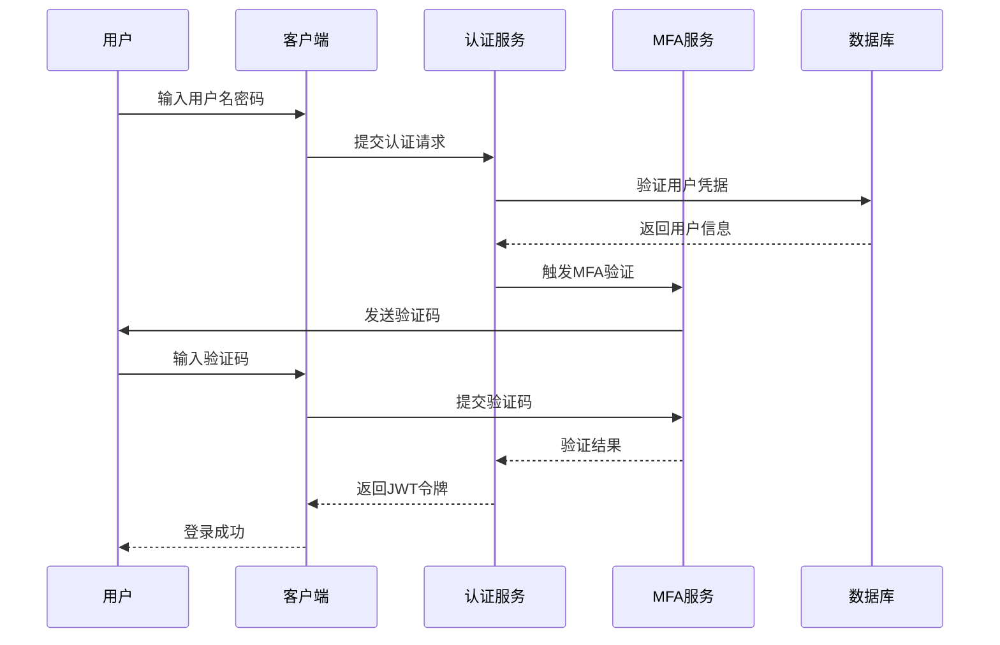

# 医疗影像诊断系统 - 安全架构设计

## 📋 文档概述

本文档详细描述了医疗影像诊断系统的安全架构设计，包括认证授权、数据加密、网络安全、应用安全、基础设施安全等全方位的安全防护体系。

**文档版本**: 1.0.0  
**创建日期**: 2025-09-24  
**更新日期**: 2025-09-24  
**作者**: 医疗影像团队  
**安全等级**: 机密

## 🎯 安全设计原则

### 核心安全原则
1. **纵深防御**: 多层安全防护，单点失效不影响整体安全
2. **最小权限**: 用户和系统组件仅获得必需的最小权限
3. **零信任**: 不信任任何用户或设备，所有访问都需验证
4. **数据保护**: 敏感数据全生命周期加密保护
5. **合规性**: 符合医疗行业安全标准和法规要求

### 安全合规标准
- **HIPAA**: 美国健康保险流通与责任法案
- **GDPR**: 欧盟通用数据保护条例
- **ISO 27001**: 信息安全管理体系国际标准
- **等保2.0**: 中国网络安全等级保护2.0
- **医疗数据安全标准**: 国家卫健委医疗数据安全规范

## 🏗️ 安全架构总览

### 五层安全架构
```
┌─────────────────────────────────────────────────────────┐
│                    用户接入层                            │
│  Web浏览器 | 移动应用 | 第三方系统 | 管理终端              │
└─────────────────────────────────────────────────────────┘
                            ↓
┌─────────────────────────────────────────────────────────┐
│                    网络安全层                            │
│  WAF | DDoS防护 | SSL/TLS | VPN | 防火墙 | IDS/IPS      │
└─────────────────────────────────────────────────────────┘
                            ↓
┌─────────────────────────────────────────────────────────┐
│                   应用安全层                             │
│  身份认证 | 权限控制 | 会话管理 | 输入验证 | 输出编码      │
└─────────────────────────────────────────────────────────┘
                            ↓
┌─────────────────────────────────────────────────────────┐
│                   数据安全层                             │
│  数据加密 | 数据脱敏 | 备份加密 | 传输加密 | 密钥管理      │
└─────────────────────────────────────────────────────────┘
                            ↓
┌─────────────────────────────────────────────────────────┐
│                 基础设施安全层                           │
│  主机加固 | 容器安全 | 网络隔离 | 监控审计 | 应急响应      │
└─────────────────────────────────────────────────────────┘
```

## 🔐 身份认证与授权

### 1. 多因素认证(MFA)

#### 认证因子
```yaml
认证因子类型:
  知识因子:
    - 用户名密码
    - 安全问题
    - PIN码
  
  持有因子:
    - 短信验证码
    - 邮件验证码
    - 硬件令牌
    - 移动应用令牌
  
  生物因子:
    - 指纹识别
    - 面部识别
    - 声纹识别
```

#### 认证流程


### 2. JWT令牌管理

#### 令牌结构
```json
{
  "header": {
    "alg": "RS256",
    "typ": "JWT",
    "kid": "key-id-2025"
  },
  "payload": {
    "sub": "user_123",
    "iss": "medical-system",
    "aud": "medical-api",
    "exp": 1640995200,
    "iat": 1640991600,
    "jti": "token_unique_id",
    "roles": ["doctor", "radiologist"],
    "permissions": ["patient:read", "study:read", "report:write"],
    "department": "radiology",
    "session_id": "session_456"
  }
}
```

#### 令牌安全策略
```yaml
访问令牌(Access Token):
  有效期: 1小时
  用途: API访问认证
  存储: 内存中，不持久化
  
刷新令牌(Refresh Token):
  有效期: 7天
  用途: 获取新的访问令牌
  存储: HttpOnly Cookie + 数据库
  
令牌轮换:
  策略: 每次刷新生成新的刷新令牌
  黑名单: 维护已撤销令牌黑名单
  
安全措施:
  - 令牌绑定IP地址
  - 令牌绑定设备指纹
  - 异常登录检测
  - 并发会话限制
```

### 3. 基于角色的访问控制(RBAC)

#### 权限模型
```yaml
权限层次结构:
  系统管理员:
    - 系统配置管理
    - 用户账户管理
    - 安全策略配置
    - 系统监控查看
  
  科室主任:
    - 科室用户管理
    - 科室数据查看
    - 报告审核批准
    - 工作流程配置
  
  主治医师:
    - 患者信息管理
    - 影像数据查看
    - 诊断报告编写
    - AI辅助诊断
  
  住院医师:
    - 患者信息查看
    - 影像数据查看
    - 报告草稿编写
  
  技师:
    - 影像数据上传
    - 设备状态管理
    - 检查预约管理
  
  护士:
    - 患者基本信息查看
    - 检查预约查看
```

#### 权限控制实现
```python
# 权限装饰器示例
@require_permissions("patient:read", "study:read")
@require_roles("doctor", "technician")
def get_patient_studies(patient_id: str, current_user: User):
    # 数据级权限控制
    if not can_access_patient(current_user, patient_id):
        raise PermissionDenied("无权访问该患者数据")
    
    # 部门级权限控制
    if current_user.department != get_patient_department(patient_id):
        if not has_cross_department_permission(current_user):
            raise PermissionDenied("无权跨部门访问数据")
    
    return get_studies_by_patient(patient_id)
```

## 🔒 数据安全保护

### 1. 数据分类分级

#### 数据分类标准
```yaml
数据分类:
  公开数据:
    - 系统公告
    - 帮助文档
    - 公开配置
    保护级别: 无需加密
  
  内部数据:
    - 用户基本信息
    - 系统日志
    - 统计数据
    保护级别: 传输加密
  
  敏感数据:
    - 患者个人信息
    - 医疗记录
    - 诊断结果
    保护级别: 存储+传输加密
  
  机密数据:
    - 身份证号
    - 病历详情
    - 基因信息
    保护级别: 强加密+访问控制
```

### 2. 加密策略

#### 存储加密
```yaml
数据库加密:
  敏感字段加密:
    算法: AES-256-GCM
    密钥管理: HSM硬件安全模块
    字段: 身份证号、手机号、地址
  
  透明数据加密(TDE):
    范围: 整个数据库文件
    算法: AES-256
    密钥轮换: 每季度自动轮换
  
文件存储加密:
  DICOM文件:
    算法: AES-256-CBC
    密钥: 每个文件独立密钥
    完整性: HMAC-SHA256校验
  
  备份加密:
    算法: AES-256-GCM
    压缩: 先压缩后加密
    验证: 数字签名验证
```

#### 传输加密
```yaml
HTTPS/TLS配置:
  协议版本: TLS 1.3
  加密套件: 
    - TLS_AES_256_GCM_SHA384
    - TLS_CHACHA20_POLY1305_SHA256
  证书: ECC P-384 + RSA 4096
  HSTS: 强制HTTPS，max-age=31536000
  
API通信:
  请求签名: HMAC-SHA256
  时间戳验证: 防重放攻击
  请求加密: 敏感参数AES加密
  
内部服务:
  mTLS: 双向TLS认证
  证书管理: 自动轮换
  网络隔离: 服务网格
```

### 3. 数据脱敏

#### 脱敏策略
```python
# 数据脱敏规则
MASKING_RULES = {
    'phone': lambda x: x[:3] + '****' + x[-4:],  # 138****1234
    'id_card': lambda x: x[:6] + '********' + x[-4:],  # 110101********1234
    'email': lambda x: x.split('@')[0][:2] + '***@' + x.split('@')[1],
    'name': lambda x: x[0] + '*' * (len(x) - 1),  # 张***
    'address': lambda x: x[:6] + '***' if len(x) > 6 else '***'
}

# 动态脱敏
def apply_data_masking(data: dict, user_role: str) -> dict:
    if user_role in ['admin', 'doctor']:
        return data  # 完整数据
    elif user_role == 'nurse':
        return mask_sensitive_fields(data, ['id_card', 'address'])
    else:
        return mask_sensitive_fields(data, ['phone', 'id_card', 'address'])
```

## 🌐 网络安全防护

### 1. 网络架构安全

#### 网络分区
```yaml
网络分区设计:
  DMZ区:
    - Web应用服务器
    - 负载均衡器
    - WAF设备
    访问控制: 仅允许HTTP/HTTPS
  
  应用区:
    - API服务器
    - 应用服务器
    - 缓存服务器
    访问控制: 仅允许应用端口
  
  数据区:
    - 数据库服务器
    - 文件存储服务器
    - 备份服务器
    访问控制: 仅允许数据库端口
  
  管理区:
    - 监控服务器
    - 日志服务器
    - 跳板机
    访问控制: 管理员专用网络
```

### 2. Web应用防火墙(WAF)

#### 防护规则
```yaml
WAF防护策略:
  OWASP Top 10防护:
    - SQL注入防护
    - XSS攻击防护
    - CSRF攻击防护
    - 文件上传漏洞防护
    - 命令注入防护
  
  自定义规则:
    - 医疗数据访问模式检测
    - 异常API调用检测
    - 大量数据下载检测
    - 敏感操作频率限制
  
  IP白名单:
    - 医院内网IP段
    - 合作机构IP
    - 管理员IP
  
  地理位置限制:
    - 仅允许国内访问
    - 特定城市限制
```

### 3. DDoS防护

#### 防护策略
```yaml
DDoS防护:
  网络层防护:
    - SYN Flood防护
    - UDP Flood防护
    - ICMP Flood防护
    清洗能力: 100Gbps
  
  应用层防护:
    - HTTP Flood防护
    - CC攻击防护
    - 慢速攻击防护
    检测阈值: 1000 req/s/IP
  
  智能防护:
    - 机器学习异常检测
    - 行为分析
    - 自适应阈值调整
```

## 🛡️ 应用安全防护

### 1. 输入验证与输出编码

#### 输入验证
```python
# 输入验证框架
from pydantic import BaseModel, validator
from typing import Optional
import re

class PatientCreateRequest(BaseModel):
    name: str
    phone: Optional[str]
    id_card: Optional[str]
    
    @validator('name')
    def validate_name(cls, v):
        if not re.match(r'^[\u4e00-\u9fa5a-zA-Z\s]{2,50}$', v):
            raise ValueError('姓名格式不正确')
        return v
    
    @validator('phone')
    def validate_phone(cls, v):
        if v and not re.match(r'^1[3-9]\d{9}$', v):
            raise ValueError('手机号格式不正确')
        return v
    
    @validator('id_card')
    def validate_id_card(cls, v):
        if v and not re.match(r'^\d{17}[\dXx]$', v):
            raise ValueError('身份证号格式不正确')
        return v

# SQL注入防护
def safe_query(query: str, params: dict):
    # 使用参数化查询
    return db.execute(text(query), params)

# XSS防护
def sanitize_html(content: str) -> str:
    import bleach
    allowed_tags = ['p', 'br', 'strong', 'em']
    return bleach.clean(content, tags=allowed_tags, strip=True)
```

### 2. 会话安全管理

#### 会话配置
```python
# 会话安全配置
SESSION_CONFIG = {
    'cookie_secure': True,  # 仅HTTPS传输
    'cookie_httponly': True,  # 防止XSS访问
    'cookie_samesite': 'Strict',  # 防CSRF
    'session_timeout': 3600,  # 1小时超时
    'max_concurrent_sessions': 3,  # 最大并发会话
    'session_regeneration': True,  # 登录后重新生成会话ID
}

# 会话固定攻击防护
def regenerate_session_id(user_id: str):
    old_session_id = get_current_session_id()
    new_session_id = generate_new_session_id()
    
    # 迁移会话数据
    migrate_session_data(old_session_id, new_session_id)
    
    # 销毁旧会话
    destroy_session(old_session_id)
    
    return new_session_id
```

### 3. 文件上传安全

#### 上传安全策略
```python
# 文件上传安全检查
class SecureFileUpload:
    ALLOWED_EXTENSIONS = {'.dcm', '.jpg', '.png', '.pdf'}
    MAX_FILE_SIZE = 100 * 1024 * 1024  # 100MB
    SCAN_TIMEOUT = 30  # 病毒扫描超时
    
    def validate_file(self, file):
        # 文件扩展名检查
        if not self.is_allowed_extension(file.filename):
            raise ValidationError("不支持的文件类型")
        
        # 文件大小检查
        if file.size > self.MAX_FILE_SIZE:
            raise ValidationError("文件大小超出限制")
        
        # 文件头检查
        if not self.validate_file_header(file):
            raise ValidationError("文件格式验证失败")
        
        # 病毒扫描
        if not self.virus_scan(file):
            raise SecurityError("文件包含恶意代码")
        
        return True
    
    def secure_filename(self, filename: str) -> str:
        # 生成安全的文件名
        import uuid
        ext = os.path.splitext(filename)[1]
        return f"{uuid.uuid4().hex}{ext}"
```

## 🔍 安全监控与审计

### 1. 安全事件监控

#### 监控指标
```yaml
安全监控指标:
  认证事件:
    - 登录失败次数
    - 异地登录检测
    - 暴力破解检测
    - 权限提升尝试
  
  数据访问:
    - 敏感数据访问
    - 大量数据下载
    - 异常时间访问
    - 跨部门数据访问
  
  系统异常:
    - 异常API调用
    - 系统错误激增
    - 性能异常
    - 配置变更
  
  网络安全:
    - 恶意IP访问
    - DDoS攻击
    - 端口扫描
    - 异常流量
```

#### 告警规则
```python
# 安全告警规则
SECURITY_ALERT_RULES = {
    'login_failure': {
        'threshold': 5,  # 5次失败
        'window': 300,   # 5分钟内
        'action': 'lock_account',
        'severity': 'medium'
    },
    'data_download': {
        'threshold': 1000,  # 1000条记录
        'window': 3600,     # 1小时内
        'action': 'notify_admin',
        'severity': 'high'
    },
    'privilege_escalation': {
        'threshold': 1,   # 任何尝试
        'window': 1,      # 立即
        'action': 'block_user',
        'severity': 'critical'
    }
}

# 实时监控
class SecurityMonitor:
    def __init__(self):
        self.redis = Redis()
        self.alert_manager = AlertManager()
    
    def track_event(self, event_type: str, user_id: str, details: dict):
        key = f"security:{event_type}:{user_id}"
        self.redis.lpush(key, json.dumps({
            'timestamp': time.time(),
            'details': details
        }))
        self.redis.expire(key, 3600)  # 1小时过期
        
        # 检查是否触发告警
        self.check_alert_rules(event_type, user_id)
```

### 2. 审计日志

#### 日志记录策略
```python
# 审计日志模型
class AuditLog:
    def __init__(self):
        self.logger = structlog.get_logger()
    
    def log_security_event(self, event_type: str, user_id: str, 
                          resource_type: str, resource_id: str,
                          action: str, result: str, details: dict):
        log_entry = {
            'timestamp': datetime.utcnow().isoformat(),
            'event_type': event_type,
            'user_id': user_id,
            'username': get_username(user_id),
            'ip_address': get_client_ip(),
            'user_agent': get_user_agent(),
            'resource_type': resource_type,
            'resource_id': resource_id,
            'action': action,
            'result': result,
            'details': details,
            'session_id': get_session_id(),
            'request_id': get_request_id()
        }
        
        # 记录到多个目标
        self.logger.info("security_event", **log_entry)
        self.store_to_database(log_entry)
        self.send_to_siem(log_entry)

# 关键操作审计
@audit_log(action="patient_create")
def create_patient(patient_data: dict, current_user: User):
    try:
        patient = Patient.create(patient_data)
        audit.log_success("patient", patient.id, patient_data)
        return patient
    except Exception as e:
        audit.log_failure("patient", None, str(e))
        raise
```

## 🚨 应急响应与恢复

### 1. 安全事件响应

#### 响应流程
```yaml
安全事件响应流程:
  事件分类:
    P0 - 严重安全事件:
      - 数据泄露
      - 系统被入侵
      - 勒索软件攻击
      响应时间: 15分钟内
    
    P1 - 高危安全事件:
      - 权限提升攻击
      - 大量异常访问
      - 系统漏洞利用
      响应时间: 1小时内
    
    P2 - 中危安全事件:
      - 暴力破解攻击
      - 异常登录行为
      - 配置错误
      响应时间: 4小时内
  
  响应团队:
    - 安全负责人
    - 系统管理员
    - 开发团队负责人
    - 法务合规人员
  
  响应步骤:
    1. 事件确认与分类
    2. 影响范围评估
    3. 紧急处置措施
    4. 证据保全
    5. 系统恢复
    6. 事后分析
```

### 2. 数据备份与恢复

#### 备份策略
```yaml
数据备份策略:
  备份类型:
    全量备份:
      频率: 每周一次
      保留期: 3个月
      存储: 异地冷存储
    
    增量备份:
      频率: 每日一次
      保留期: 1个月
      存储: 本地热存储
    
    实时备份:
      频率: 实时同步
      保留期: 7天
      存储: 同城灾备
  
  备份验证:
    - 每月恢复测试
    - 数据完整性校验
    - 恢复时间测试
    - 备份文件加密验证
```

## 📋 安全合规检查

### 1. 合规要求

#### HIPAA合规
```yaml
HIPAA合规要求:
  管理保障措施:
    - 指定安全负责人
    - 制定安全政策
    - 员工安全培训
    - 定期安全评估
  
  物理保障措施:
    - 设施访问控制
    - 工作站使用限制
    - 设备和媒体控制
  
  技术保障措施:
    - 访问控制
    - 审计控制
    - 完整性保护
    - 传输安全
```

### 2. 安全评估

#### 定期安全评估
```python
# 安全评估检查项
SECURITY_CHECKLIST = {
    'authentication': [
        '密码策略是否符合要求',
        'MFA是否正确配置',
        '会话超时是否合理',
        '账户锁定策略是否有效'
    ],
    'authorization': [
        '权限分配是否遵循最小权限原则',
        '角色定义是否清晰',
        '权限审查是否定期进行',
        '特权账户是否受到监控'
    ],
    'data_protection': [
        '敏感数据是否加密存储',
        '传输过程是否加密',
        '数据备份是否安全',
        '数据销毁是否彻底'
    ],
    'network_security': [
        '防火墙规则是否最新',
        'WAF是否正常工作',
        '网络分段是否有效',
        'VPN配置是否安全'
    ]
}

# 自动化安全扫描
class SecurityScanner:
    def run_vulnerability_scan(self):
        # 漏洞扫描
        results = []
        results.extend(self.scan_web_vulnerabilities())
        results.extend(self.scan_network_vulnerabilities())
        results.extend(self.scan_configuration_issues())
        return results
    
    def generate_security_report(self):
        # 生成安全报告
        report = {
            'scan_date': datetime.now(),
            'vulnerabilities': self.run_vulnerability_scan(),
            'compliance_status': self.check_compliance(),
            'recommendations': self.generate_recommendations()
        }
        return report
```

---

**维护说明**: 本安全架构设计文档将随着安全威胁环境和合规要求的变化持续更新，确保系统安全防护能力始终保持在最佳状态。
