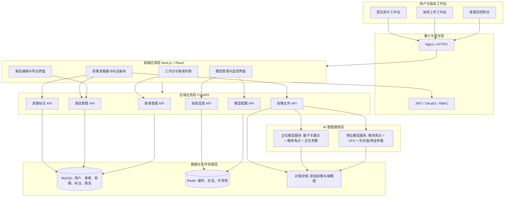
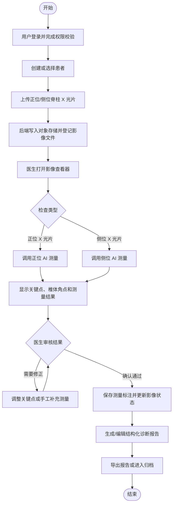
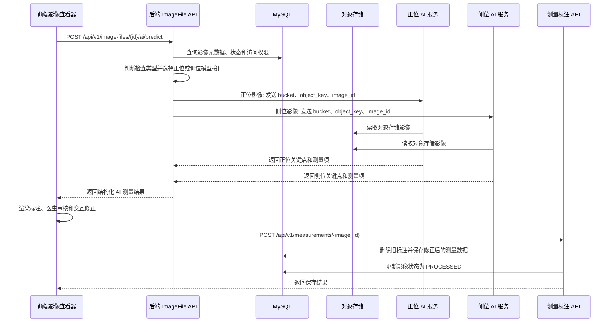
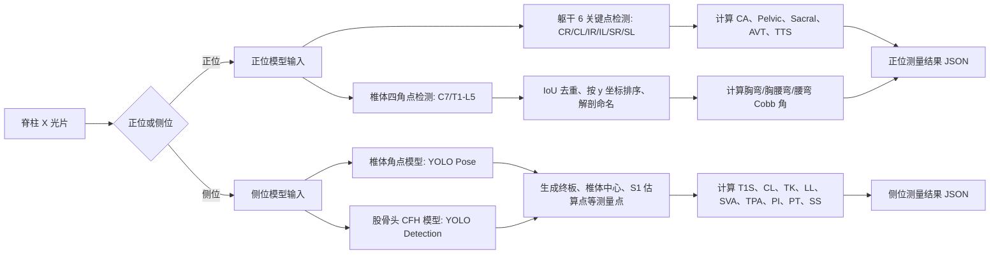
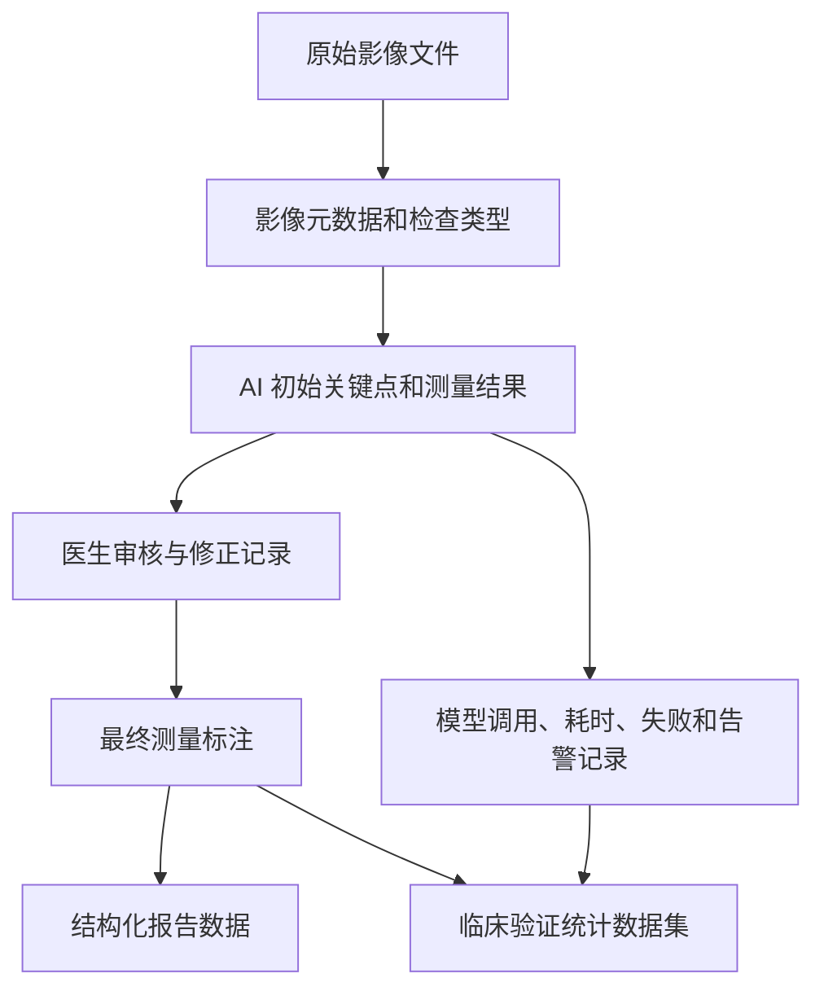

# 协和脊柱智能影像系统整体架构与流程图说明

## 1. 文档目的

本文用于说明协和脊柱智能影像系统的整体技术架构、临床业务流程和 AI 推理流程，可作为论文 Figure 1、系统汇报材料或技术交付文档的基础版本。文档重点放在“影像上传 - AI 测量 - 医生审核修正 - 结构化报告 - 数据留存”的闭环，而不是单纯罗列前后端技术栈。

系统由前端影像工作站、后端业务 API、对象存储、关系数据库、缓存/会话组件、正位与侧位 AI 推理服务、报告与监控模块组成。医生或技师通过 Web 端上传脊柱 X 光片，后端完成权限校验、对象存储写入和影像元数据登记；影像进入阅片界面后，系统根据检查类型调用正位或侧位模型服务，返回关键点、椎体角点和结构化测量结果。医生可在影像查看器中确认、调整或删除 AI 结果，最终保存为测量标注数据并进入报告生成和导出流程。

## 2. 整体架构示意图

### 架构说明

1. **前端应用层**：基于 Next.js、React 和 TypeScript，提供患者列表、影像列表、影像查看器、AI 标注交互、报告编辑和模型管理界面。影像查看器负责将 AI 返回的关键点和测量项转换为可视化标注，并支持医生交互修正。
2. **后端业务层**：基于 FastAPI 聚合用户认证、患者管理、影像文件管理、测量标注保存、报告管理、模型配置和监控接口。影像相关 API 统一挂载在 `/api/v1/image-files`、`/api/v1/measurements`、`/api/v1/models` 等业务路由下。
3. **数据与文件存储层**：MySQL 保存结构化业务数据，包含用户、权限、患者、影像文件、测量标注和报告等信息；对象存储保存上传影像文件；Redis 用于缓存、会话和后端任务并发控制。
4. **AI 推理服务层**：正位与侧位模型以独立服务形式接入后端。后端根据影像检查类型选择正位或侧位 object 接口，向模型服务传递对象存储 bucket、object key 和 image id，模型服务读取影像并返回关键点或测量结果。

## 3. 临床业务流程图

### 流程说明

该流程体现系统在临床读片中的人机协作模式。系统并不把 AI 结果直接作为最终诊断，而是先自动生成关键测量点和参数，再由医生在同一阅片界面进行审核、修正和确认。修正后的结果保存到测量标注表中，作为报告生成、后续统计和质量追踪的数据来源。

对临床论文而言，这一流程可描述为 AI-assisted radiographic measurement workflow。核心评价终点可以围绕 AI 初始测量与专家金标准的一致性、医生修正后结果的一致性、人工测量耗时与 AI 辅助耗时差异、失败率和修正负担展开。

## 4. AI 推理与结果回写流程图

### 推理流程说明

前端在需要自动测量时调用后端 `/api/v1/image-files/{id}/ai/predict`；需要原始关键点时调用 `/api/v1/image-files/{id}/ai/detect-keypoints`。后端先校验用户是否有权访问该影像，并确认影像已完成上传。随后根据影像检查类型选择正位或侧位 AI object 接口，并将对象存储位置传给模型服务。模型服务直接从对象存储读取影像，避免前端或后端反复传输大文件。

AI 结果返回前端后，前端将其渲染为可交互标注。医生完成审核或修正后，前端通过 `/api/v1/measurements/{image_id}` 保存最终测量结果。后端保存时会删除该影像旧标注，写入新的测量项，并将影像状态更新为已处理。

## 5. 正位与侧位 AI 模型流程

### 模型流程说明

正位模型服务包含躯干关键点检测和椎体角点检测两个主要分支。躯干关键点用于肩倾斜、骨盆倾斜、骶骨倾斜和躯干偏移等指标；椎体角点经过去重、纵向排序和解剖命名后，用于 Cobb 角相关计算。该后处理策略降低了模型原始类别偏移对椎体命名的影响。

侧位模型服务采用椎体角点和股骨头位置双分支。椎体角点模型输出 C7、胸椎和腰椎的四角点；CFH 检测模型输出股骨头中心。随后系统生成各矢状面指标所需的测量点，并计算 T1 Slope、Cervical Lordosis、Thoracic Kyphosis、Lumbar Lordosis、SVA、TPA、PI、PT 和 SS 等参数。

## 6. 数据闭环与质量控制

数据闭环由四类核心数据构成：原始影像与元数据、AI 初始输出、医生修正后的最终标注、报告和监控数据。若用于临床研究，建议在正式部署版本中导出以下字段：影像匿名编号、正/侧位类型、AI 模型版本、AI 输出关键点、AI 测量值、推理耗时、总耗时、失败状态、医生修正记录、专家金标准和人工测量耗时。

## 7. 论文图题建议

- **Figure 1. Overall architecture of the AI-assisted spinal radiographic measurement system.** 展示前端工作站、后端 API、对象存储、数据库、正位/侧位 AI 服务、报告和监控模块之间的关系。
- **Figure 2. Clinical workflow of AI-assisted radiographic measurement and report generation.** 展示从影像上传、AI 自动测量、医生审核修正到结构化报告输出的临床工作流。
- **Figure 3. AI inference pipeline for coronal and sagittal spinal parameters.** 展示正位和侧位模型分支、关键点/角点检测、后处理和参数计算流程。

## 8. 与代码实现对应关系

| 架构/流程节点 | 代码或文档位置 | 说明 |
| --- | --- | --- |
| 前端 AI 测量调用 | `frontend/services/imageServices/aiMeasurementService.ts` | 调用 `/api/v1/image-files/{id}/ai/predict` 和 `/ai/detect-keypoints` |
| 前端外部 AI 直连调用 | `frontend/services/imageServices/aiAnnotationService.ts` | 根据环境变量调用正位或侧位关键点检测接口 |
| 影像文件 AI 转发 | `backend/app/api/v1/endpoints/imaging/handlers/files.py` | 根据检查类型选择正位/侧位 object 接口，向模型服务发送对象存储位置 |
| 测量标注保存 | `backend/app/api/v1/endpoints/imaging/handlers/annotations.py` | 保存医生确认或修正后的测量数据，并更新影像状态 |
| 影像 API 路由 | `backend/app/api/v1/endpoints/imaging/router.py` | 聚合 upload、image-files、measurements、ai-diagnosis 和 models 路由 |
| 正位模型服务 | `model/ap/README.md` | 说明正位 `/predict`、`/detect_keypoints`、关键点和测量项输出 |
| 侧位模型服务 | `model/lat/README.md` | 说明侧位检测、关键点生成和指标计算三步流程 |

