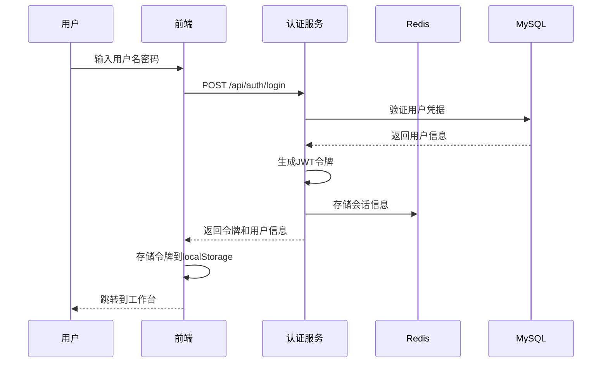
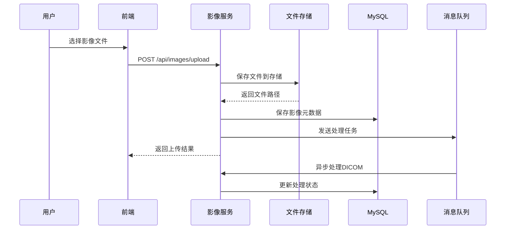
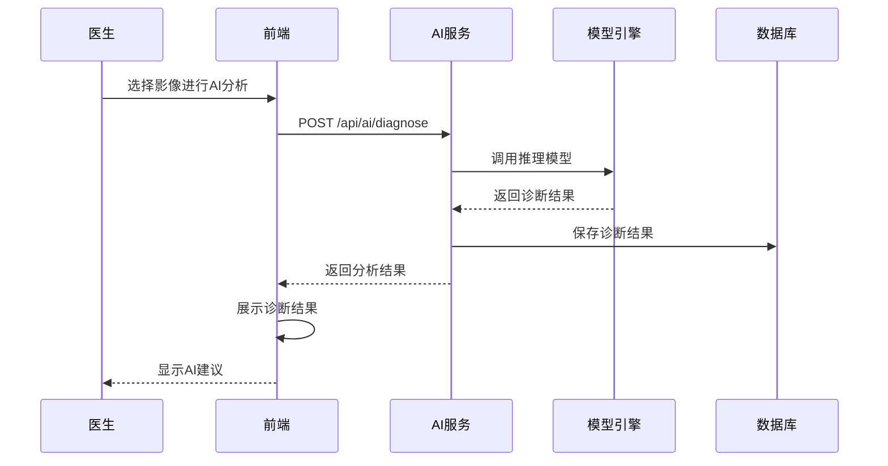

# 医疗影像诊断系统 - 系统架构文档

## 📋 文档概述

本文档详细描述了医疗影像诊断系统的整体架构设计，包括技术选型、系统架构、数据流设计等核心内容。

**文档版本**: 1.0.0  
**创建日期**: 2025-09-24  
**更新日期**: 2025-09-24  
**作者**: 医疗影像团队

## 🎯 系统概述

### 系统定位
医疗影像诊断系统是一个基于现代Web技术栈的医疗信息化平台，旨在为医疗机构提供高效、安全、智能的影像诊断解决方案。

### 核心功能
- **患者管理**: 患者信息管理、档案维护、就诊记录
- **影像管理**: DICOM影像上传、存储、预览、处理
- **诊断报告**: 报告生成、编辑、审核、导出
- **AI辅助诊断**: 模型管理、智能分析、结果展示
- **权限管理**: 基于RBAC的用户权限控制
- **系统监控**: 操作日志、性能监控、异常告警

### 设计原则
1. **高可用性**: 系统7×24小时稳定运行
2. **高性能**: 支持大量并发用户和大文件处理
3. **安全性**: 符合医疗数据安全标准
4. **可扩展性**: 支持功能模块化扩展
5. **易维护性**: 代码结构清晰，文档完善

## 🏗️ 技术选型

### 前端技术栈
| 技术 | 版本 | 用途 | 选型理由 |
|------|------|------|----------|
| **Next.js** | 15.x | React框架 | SSR/SSG支持，性能优化，开发体验好 |
| **React** | 19.x | UI库 | 生态丰富，组件化开发，社区活跃 |
| **TypeScript** | 5.x | 类型系统 | 类型安全，代码提示，减少错误 |
| **Tailwind CSS** | 3.x | CSS框架 | 原子化CSS，快速开发，一致性好 |
| **Zustand** | 4.x | 状态管理 | 轻量级，简单易用，TypeScript友好 |
| **React Query** | 5.x | 数据获取 | 缓存管理，自动重试，离线支持 |
| **Axios** | 1.x | HTTP客户端 | 请求拦截，响应处理，错误处理 |
| **Cornerstone.js** | 3.x | DICOM查看器 | 医学影像专用，功能强大，性能好 |

### 后端技术栈
| 技术 | 版本 | 用途 | 选型理由 |
|------|------|------|----------|
| **Python** | 3.9+ | 编程语言 | 语法简洁，生态丰富，AI库支持好 |
| **FastAPI** | 0.104+ | Web框架 | 高性能，自动文档，类型提示 |
| **SQLAlchemy** | 2.x | ORM框架 | 功能强大，支持复杂查询，迁移方便 |
| **Alembic** | 1.x | 数据库迁移 | 版本控制，自动迁移，回滚支持 |
| **Pydantic** | 2.x | 数据验证 | 类型验证，序列化，文档生成 |
| **Celery** | 5.x | 任务队列 | 异步处理，分布式，监控支持 |
| **PyDICOM** | 2.x | DICOM处理 | 医学影像标准，元数据提取 |
| **Pillow** | 10.x | 图像处理 | 图像转换，缩略图生成 |

### 数据存储
| 技术 | 版本 | 用途 | 选型理由 |
|------|------|------|----------|
| **MySQL** | 8.0+ | 关系数据库 | ACID特性，事务支持，生态成熟 |
| **Redis** | 7.x | 缓存/消息队列 | 高性能，数据结构丰富，持久化 |
| **MinIO** | - | 对象存储 | S3兼容，分布式，高可用 |

### 基础设施
| 技术 | 版本 | 用途 | 选型理由 |
|------|------|------|----------|
| **Docker** | 24.x | 容器化 | 环境一致性，部署简化，资源隔离 |
| **Nginx** | 1.24+ | 反向代理 | 高性能，负载均衡，静态文件服务 |
| **Prometheus** | 2.x | 监控系统 | 指标收集，告警规则，生态丰富 |
| **Grafana** | 10.x | 可视化 | 仪表板，图表展示，告警通知 |

## 🏛️ 系统架构

### 整体架构图

```
┌─────────────────────────────────────────────────────────────┐
│                        用户层                                │
├─────────────────────────────────────────────────────────────┤
│  医生工作站  │  技师工作站  │  管理员控制台  │  移动端应用    │
└─────────────────────────────────────────────────────────────┘
                                │
                                ▼
┌─────────────────────────────────────────────────────────────┐
│                      负载均衡层                              │
├─────────────────────────────────────────────────────────────┤
│              Nginx (反向代理 + 负载均衡)                     │
└─────────────────────────────────────────────────────────────┘
                                │
                                ▼
┌─────────────────────────────────────────────────────────────┐
│                      应用层                                  │
├─────────────────────────────────────────────────────────────┤
│  前端应用 (Next.js)  │  后端API (FastAPI)  │  AI服务        │
│  ├─ 用户界面         │  ├─ 业务逻辑        │  ├─ 模型管理    │
│  ├─ 状态管理         │  ├─ 数据验证        │  ├─ 推理服务    │
│  ├─ 路由控制         │  ├─ 权限控制        │  └─ 结果处理    │
│  └─ 组件库           │  └─ API接口         │                │
└─────────────────────────────────────────────────────────────┘
                                │
                                ▼
┌─────────────────────────────────────────────────────────────┐
│                      服务层                                  │
├─────────────────────────────────────────────────────────────┤
│  认证服务  │  患者服务  │  影像服务  │  报告服务  │  通知服务  │
│  ├─ JWT    │  ├─ CRUD   │  ├─ 上传   │  ├─ 生成   │  ├─ 邮件   │
│  ├─ RBAC   │  ├─ 搜索   │  ├─ 存储   │  ├─ 编辑   │  ├─ 短信   │
│  └─ 会话   │  └─ 统计   │  └─ 处理   │  └─ 导出   │  └─ 推送   │
└─────────────────────────────────────────────────────────────┘
                                │
                                ▼
┌─────────────────────────────────────────────────────────────┐
│                      数据层                                  │
├─────────────────────────────────────────────────────────────┤
│    MySQL        │     Redis        │    文件存储             │
│  ├─ 业务数据    │  ├─ 缓存         │  ├─ 影像文件            │
│  ├─ 用户信息    │  ├─ 会话         │  ├─ 报告文件            │
│  ├─ 系统配置    │  ├─ 队列         │  └─ 静态资源            │
│  └─ 操作日志    │  └─ 计数器       │                        │
└─────────────────────────────────────────────────────────────┘
                                │
                                ▼
┌─────────────────────────────────────────────────────────────┐
│                      监控层                                  │
├─────────────────────────────────────────────────────────────┤
│  Prometheus  │   Grafana   │   ELK Stack   │   告警系统     │
│  ├─ 指标收集 │  ├─ 仪表板  │  ├─ 日志收集  │  ├─ 邮件告警   │
│  ├─ 时序存储 │  ├─ 图表    │  ├─ 日志分析  │  ├─ 短信告警   │
│  └─ 告警规则 │  └─ 告警    │  └─ 搜索查询  │  └─ 钉钉告警   │
└─────────────────────────────────────────────────────────────┘
```

### 微服务架构设计

#### 服务拆分原则
1. **业务边界清晰**: 按业务领域拆分服务
2. **数据独立**: 每个服务拥有独立的数据存储
3. **接口标准**: 统一的API接口规范
4. **故障隔离**: 服务间故障不相互影响

#### 核心服务模块

```
医疗影像诊断系统
├── 用户认证服务 (Auth Service)
│   ├── 用户注册/登录
│   ├── JWT令牌管理
│   ├── 权限验证
│   └── 会话管理
├── 患者管理服务 (Patient Service)
│   ├── 患者信息CRUD
│   ├── 患者档案管理
│   ├── 就诊记录
│   └── 患者搜索
├── 影像管理服务 (Image Service)
│   ├── 文件上传/下载
│   ├── DICOM处理
│   ├── 影像预览
│   └── 元数据管理
├── 诊断报告服务 (Report Service)
│   ├── 报告生成
│   ├── 报告编辑
│   ├── 报告审核
│   └── 报告导出
├── AI推理服务 (AI Service)
│   ├── 模型管理
│   ├── 推理调用
│   ├── 结果处理
│   └── 性能监控
├── 通知服务 (Notification Service)
│   ├── 邮件通知
│   ├── 短信通知
│   ├── 站内消息
│   └── 推送通知
└── 系统管理服务 (System Service)
    ├── 配置管理
    ├── 日志管理
    ├── 监控告警
    └── 数据备份
```

## 🔄 数据流设计

### 用户认证流程



### 影像上传流程



### AI诊断流程



## 🔒 安全架构

### 安全层次设计

```
┌─────────────────────────────────────────┐
│              网络安全层                  │
│  ├─ 防火墙配置                          │
│  ├─ DDoS防护                           │
│  ├─ IP白名单                           │
│  └─ SSL/TLS加密                        │
├─────────────────────────────────────────┤
│              应用安全层                  │
│  ├─ 身份认证 (JWT)                     │
│  ├─ 权限控制 (RBAC)                    │
│  ├─ 输入验证                           │
│  ├─ SQL注入防护                        │
│  ├─ XSS防护                           │
│  └─ CSRF防护                          │
├─────────────────────────────────────────┤
│              数据安全层                  │
│  ├─ 数据加密存储                        │
│  ├─ 传输加密                           │
│  ├─ 敏感数据脱敏                        │
│  ├─ 数据备份                           │
│  └─ 访问审计                           │
├─────────────────────────────────────────┤
│              基础设施安全层               │
│  ├─ 容器安全                           │
│  ├─ 镜像扫描                           │
│  ├─ 网络隔离                           │
│  └─ 资源限制                           │
└─────────────────────────────────────────┘
```

### 权限控制模型

```
用户 (User)
├── 角色 (Role)
│   ├── 管理员 (Admin)
│   │   └── 系统管理权限
│   ├── 医生 (Doctor)
│   │   ├── 患者管理权限
│   │   ├── 影像查看权限
│   │   └── 报告编写权限
│   ├── 技师 (Technician)
│   │   ├── 影像上传权限
│   │   └── 设备管理权限
│   └── 护士 (Nurse)
│       └── 患者信息查看权限
└── 权限 (Permission)
    ├── 资源权限
    │   ├── 患者管理 (patient:*)
    │   ├── 影像管理 (image:*)
    │   ├── 报告管理 (report:*)
    │   └── 系统管理 (system:*)
    └── 操作权限
        ├── 创建 (create)
        ├── 读取 (read)
        ├── 更新 (update)
        └── 删除 (delete)
```

## 📊 性能设计

### 性能指标
- **响应时间**: API响应时间 < 200ms
- **并发用户**: 支持1000+并发用户
- **文件上传**: 支持100MB+大文件上传
- **系统可用性**: 99.9%以上
- **数据库查询**: 复杂查询 < 1s

### 性能优化策略

#### 前端优化
- **代码分割**: 按路由和组件分割代码
- **懒加载**: 图片和组件懒加载
- **缓存策略**: 静态资源缓存
- **CDN加速**: 静态文件CDN分发

#### 后端优化
- **数据库优化**: 索引优化、查询优化
- **缓存策略**: Redis多级缓存
- **异步处理**: Celery任务队列
- **连接池**: 数据库连接池优化

#### 基础设施优化
- **负载均衡**: Nginx负载均衡
- **容器优化**: Docker镜像优化
- **监控告警**: 实时性能监控
- **自动扩缩容**: 基于负载自动扩容

## 🔧 部署架构

### 容器化部署

```
生产环境部署架构
├── 负载均衡层
│   └── Nginx (2个实例)
├── 应用层
│   ├── 前端服务 (3个实例)
│   ├── 后端API (3个实例)
│   └── AI服务 (2个实例)
├── 数据层
│   ├── MySQL主从 (1主2从)
│   ├── Redis集群 (3个节点)
│   └── 文件存储 (MinIO集群)
└── 监控层
    ├── Prometheus
    ├── Grafana
    └── ELK Stack
```

### 环境隔离

```
开发环境 (Development)
├── 本地开发环境
├── Docker Compose
└── 热重载支持

测试环境 (Testing)
├── 自动化测试
├── 性能测试
└── 安全测试

预生产环境 (Staging)
├── 生产环境镜像
├── 数据脱敏
└── 用户验收测试

生产环境 (Production)
├── 高可用部署
├── 监控告警
└── 自动备份
```

## 📈 扩展性设计

### 水平扩展
- **无状态设计**: 应用服务无状态，支持水平扩展
- **数据库分片**: 支持数据库水平分片
- **缓存集群**: Redis集群支持
- **文件存储**: 分布式文件存储

### 垂直扩展
- **资源监控**: 实时监控资源使用
- **自动扩容**: 基于指标自动扩容
- **性能调优**: 持续性能优化
- **容量规划**: 定期容量评估

---

**文档维护**: 本文档将随系统演进持续更新，确保架构设计与实际实现保持一致。
