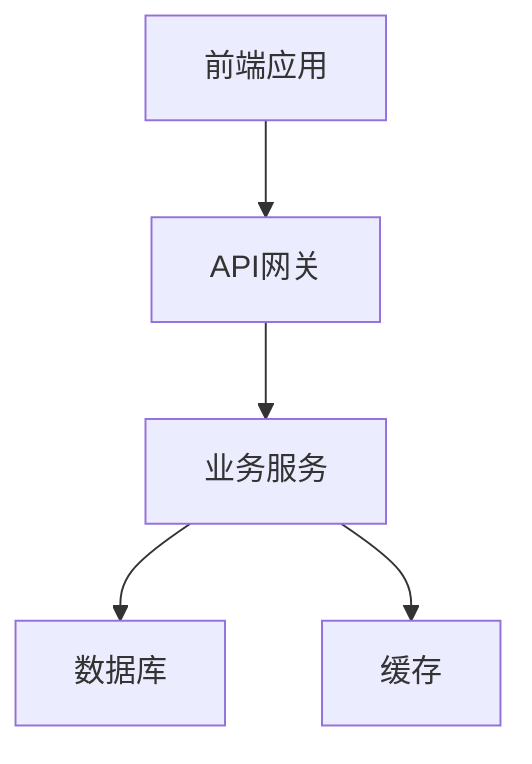
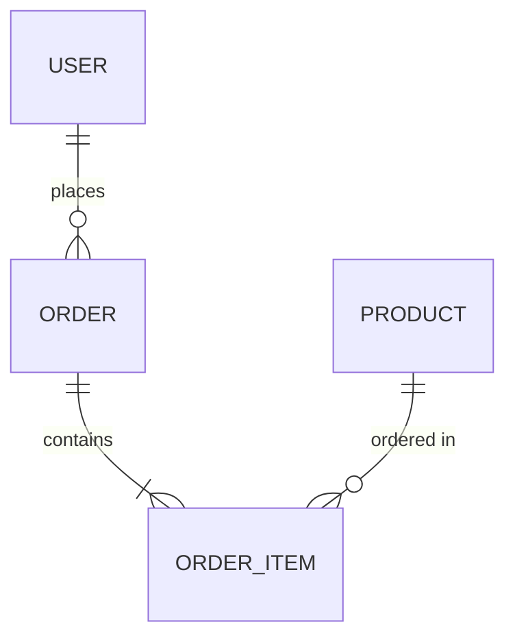
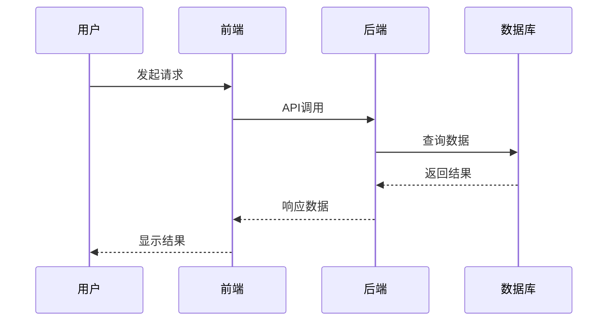

# 技术设计文档模板

> 这是一个技术设计文档的标准模板，请根据实际设计填写相关内容

# [功能/模块名称] 技术设计文档

## 文档信息
- **文档版本**: v1.0
- **创建日期**: 2025-09-24
- **最后更新**: 2025-09-24
- **作者**: [作者姓名]
- **审核人**: [审核人姓名]
- **状态**: [草稿/审核中/已批准]

## 概述

### 背景
[描述为什么需要这个功能/模块，解决什么问题]

### 目标
- [目标1]: [具体描述]
- [目标2]: [具体描述]
- [目标3]: [具体描述]

### 范围
**包含内容**:
- [功能点1]
- [功能点2]
- [功能点3]

**不包含内容**:
- [排除项1]
- [排除项2]

## 需求分析

### 功能需求
| 需求ID | 需求描述 | 优先级 | 验收标准 |
|--------|----------|--------|----------|
| FR-001 | [功能需求1] | 高 | [验收标准] |
| FR-002 | [功能需求2] | 中 | [验收标准] |
| FR-003 | [功能需求3] | 低 | [验收标准] |

### 非功能需求
| 需求类型 | 具体要求 | 指标 |
|----------|----------|------|
| 性能 | [性能要求] | [具体指标] |
| 可用性 | [可用性要求] | [具体指标] |
| 安全性 | [安全要求] | [具体指标] |
| 可扩展性 | [扩展性要求] | [具体指标] |

## 系统设计

### 整体架构
[描述系统的整体架构设计]



### 技术栈选择
| 层级 | 技术选择 | 版本 | 选择理由 |
|------|----------|------|----------|
| 前端 | [技术名称] | [版本] | [选择理由] |
| 后端 | [技术名称] | [版本] | [选择理由] |
| 数据库 | [技术名称] | [版本] | [选择理由] |
| 缓存 | [技术名称] | [版本] | [选择理由] |

## 详细设计

### 数据模型设计

#### 实体关系图


#### 数据表设计
**表名**: [table_name]
```sql
CREATE TABLE table_name (
    id BIGINT PRIMARY KEY AUTO_INCREMENT COMMENT '主键ID',
    name VARCHAR(100) NOT NULL COMMENT '名称',
    status TINYINT DEFAULT 1 COMMENT '状态: 1-启用, 0-禁用',
    created_at TIMESTAMP DEFAULT CURRENT_TIMESTAMP COMMENT '创建时间',
    updated_at TIMESTAMP DEFAULT CURRENT_TIMESTAMP ON UPDATE CURRENT_TIMESTAMP COMMENT '更新时间',
    
    INDEX idx_name (name),
    INDEX idx_status (status),
    INDEX idx_created_at (created_at)
) ENGINE=InnoDB DEFAULT CHARSET=utf8mb4 COMMENT='[表说明]';
```

### API 设计

#### 接口列表
| 接口名称 | 方法 | 路径 | 描述 |
|----------|------|------|------|
| [接口1] | POST | /api/v1/resource | [描述] |
| [接口2] | GET | /api/v1/resource/{id} | [描述] |
| [接口3] | PUT | /api/v1/resource/{id} | [描述] |
| [接口4] | DELETE | /api/v1/resource/{id} | [描述] |

#### 接口详细设计
**接口名称**: [接口名称]
- **路径**: `/api/v1/resource`
- **方法**: `POST`
- **描述**: [接口功能描述]

**请求格式**:
```json
{
  "field1": "string",
  "field2": "integer",
  "field3": {
    "nested_field": "value"
  }
}
```

**响应格式**:
```json
{
  "success": true,
  "data": {
    "id": 123,
    "field1": "value",
    "created_at": "2025-09-24T10:00:00Z"
  },
  "message": "操作成功"
}
```

### 业务流程设计

#### 主要业务流程


#### 异常处理流程
[描述各种异常情况的处理流程]

### 安全设计

#### 认证授权
- **认证方式**: [JWT/OAuth2/其他]
- **授权机制**: [RBAC/ABAC/其他]
- **权限控制**: [具体权限控制策略]

#### 数据安全
- **数据加密**: [加密方式和范围]
- **传输安全**: [HTTPS/TLS配置]
- **存储安全**: [数据库加密策略]

#### 安全审计
- **操作日志**: [记录哪些操作]
- **访问日志**: [记录访问信息]
- **安全监控**: [监控策略]

### 性能设计

#### 性能目标
| 指标 | 目标值 | 测试方法 |
|------|--------|----------|
| 响应时间 | < 200ms | [测试方法] |
| 并发用户 | 1000+ | [测试方法] |
| 吞吐量 | 10000 TPS | [测试方法] |

#### 性能优化策略
- **缓存策略**: [缓存设计]
- **数据库优化**: [索引、分区等]
- **代码优化**: [算法、数据结构优化]

## 实现计划

### 开发阶段
| 阶段 | 任务 | 预计工期 | 负责人 | 依赖 |
|------|------|----------|--------|------|
| 阶段1 | [任务描述] | [工期] | [负责人] | [依赖项] |
| 阶段2 | [任务描述] | [工期] | [负责人] | [依赖项] |
| 阶段3 | [任务描述] | [工期] | [负责人] | [依赖项] |

### 里程碑
- **[里程碑1]**: [日期] - [描述]
- **[里程碑2]**: [日期] - [描述]
- **[里程碑3]**: [日期] - [描述]

## 测试计划

### 测试策略
- **单元测试**: [覆盖率要求和测试重点]
- **集成测试**: [测试范围和方法]
- **系统测试**: [测试场景和用例]
- **性能测试**: [测试指标和方法]

### 测试用例
| 用例ID | 测试场景 | 预期结果 | 优先级 |
|--------|----------|----------|--------|
| TC-001 | [测试场景1] | [预期结果] | 高 |
| TC-002 | [测试场景2] | [预期结果] | 中 |

## 部署方案

### 部署架构
[描述生产环境的部署架构]

### 部署步骤
1. [部署步骤1]
2. [部署步骤2]
3. [部署步骤3]

### 回滚方案
[描述出现问题时的回滚策略]

## 监控和运维

### 监控指标
- **业务指标**: [关键业务指标]
- **技术指标**: [系统性能指标]
- **错误监控**: [错误类型和阈值]

### 告警策略
| 指标 | 阈值 | 告警级别 | 处理方式 |
|------|------|----------|----------|
| [指标1] | [阈值] | [级别] | [处理方式] |
| [指标2] | [阈值] | [级别] | [处理方式] |

## 风险评估

### 技术风险
| 风险 | 影响程度 | 发生概率 | 应对措施 |
|------|----------|----------|----------|
| [风险1] | [高/中/低] | [高/中/低] | [应对措施] |
| [风险2] | [高/中/低] | [高/中/低] | [应对措施] |

### 业务风险
| 风险 | 影响程度 | 发生概率 | 应对措施 |
|------|----------|----------|----------|
| [风险1] | [高/中/低] | [高/中/低] | [应对措施] |
| [风险2] | [高/中/低] | [高/中/低] | [应对措施] |

## 相关文档
- [需求文档](./requirements.md)
- [API文档](./api.md)
- [用户手册](./user-guide.md)
- [部署文档](./deployment.md)

## 更新日志
| 日期 | 版本 | 更新内容 | 更新人 |
|------|------|----------|--------|
| 2025-09-24 | v1.0 | 初始版本 | [作者名] |

---

**注意**: 请在使用此模板时，将所有 `[占位符]` 替换为实际内容，并根据项目实际情况调整模板结构。
